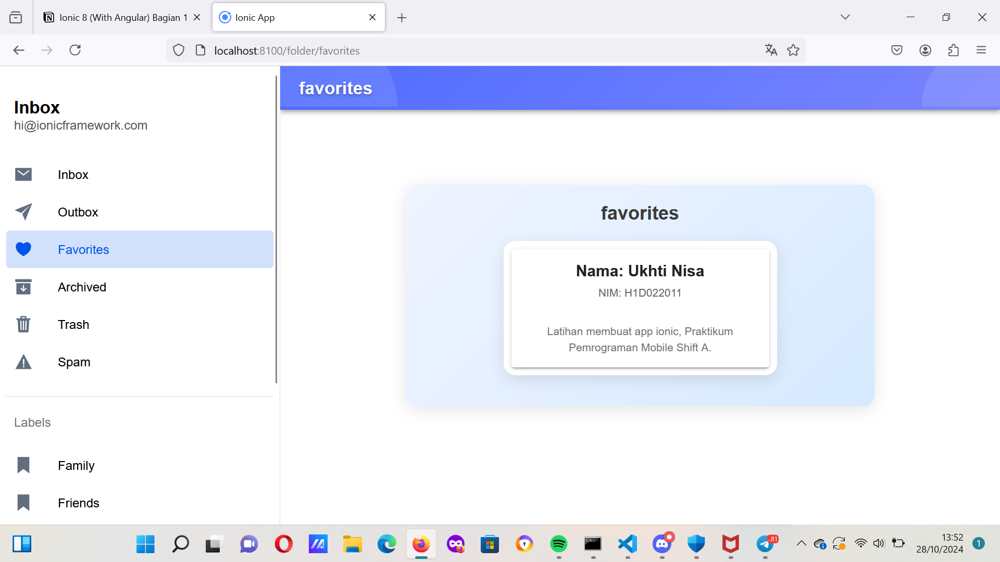
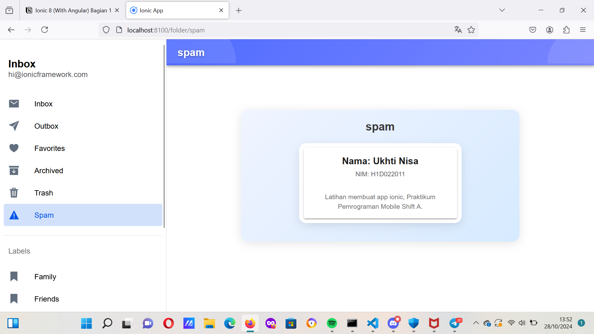

# Langkah- langkah
- mengubah tampilan pada folder.page.html
- mendekorasi tampilan pada folder.page.scss
- menjalankan app tersebut pada cmd dengan perintah ionic serve
- 
## Penjelasan kode folder.page.html
1. <ion-header>dan Konfigurasi Toolbar
<ion-header [translucent]="true">
  <ion-toolbar>
    <ion-buttons slot="start">
      <ion-menu-button></ion-menu-button>
    </ion-buttons>
    <ion-title>{{ folder }}</ion-title>
  </ion-toolbar>
</ion-header>

- <ion-header>: Mendefinisikan area header halaman. Yang [translucent]="true"atribut membuat header semi-transparan pada perangkat yang didukung.
- <ion-toolbar>: Berisi elemen toolbar dalam header.
- <ion-buttons slot="start">Menentukan sekelompok tombol ditempatkan di posisi "mulai" (biasanya sisi kiri). Di sini, ia berisi <ion-menu-button>, yang digunakan untuk beralih menu samping.
- <ion-title>{{ folder }}</ion-title>: Menampilkan judul di toolbar. Dua-ganda keriting braces ({{ folder }}) menunjukkan pengikatan data dalam Angular, di mana nilai foldervariabel akan ditampilkan.
2. <ion-content>Konfigurasi
  <ion-content [fullscreen]="true">
  <ion-header collapse="condense">
    <ion-toolbar>
      <ion-title size="large">{{ folder }}</ion-title>
    </ion-toolbar>
  </ion-header>

- <ion-content>: Area konten utama dari halaman. Yang [fullscreen]="true"atribut memastikan konten meluas untuk mengisi seluruh layar.
- <ion-header collapse="condense">: Menyediakan header opsional yang muncul ketika header utama menggulir di luar layar. Yang collapse="condense"atribut membuatnya menyusut ke versi yang lebih kecil.
- <ion-toolbar>dan <ion-title>Di dalam sundulan yang runtuh, mereka menampilkan judul yang sama dengan header utama, tetapi dalam ukuran yang lebih besar (size="large"), untuk menekankan keadaan yang runtuh.
3. Area Konten Utama
    

    <strong class="capitalize">{{ folder }}</strong>
    

      <ion-card>
        <ion-card-header>
          <ion-card-title>Nama: Ukhti Nisa</ion-card-title>
          <ion-card-subtitle>NIM: H1D022011</ion-card-subtitle>
        </ion-card-header>

        <ion-card-content>
          Latihan membuat app ionic, Praktikum Pemrograman Mobile Shift A.
        </ion-card-content>
      </ion-card>
    

  

</ion-content>

- 
: Membungkus seluruh bagian konten, menyediakan wadah untuk styling.
- <strong class="capitalize">{{ folder }}</strong>: Menampilkan foldervariabel lagi, menggunakan strongtag untuk berani teks dan menerapkan capitalizeCSS kelas untuk membuat huruf pertama huruf besar.
- 
: Membungkus konten kartu. Div ini dapat digunakan untuk styling dan positioning.
- <ion-card>Mewakili komponen kartu, yang biasa digunakan untuk menyajikan informasi dengan cara yang menarik secara visual.
    - <ion-card-header>: Berisi bagian header dari kartu.
        - <ion-card-title>: Menampilkan judul "Nama: Ukhti Nisa".
        - <ion-card-subtitle>: Menunjukkan subjudul "NIM: H1D022011".
    - <ion-card-content>Berisi konten utama dari kartu, yang dalam hal ini adalah deskripsi latihan aplikasi.
## Penjelasan kode folder.page.scss
/* Enhanced header styling */
ion-header {
  background: linear-gradient(135deg, #4f6cff, #7a85ff);
  color: #fff;
  position: relative;
  overflow: hidden;
}

/* Adding decorative background elements */
ion-header::before {
  content: "";
  position: absolute;
  top: -50px;
  left: -50px;
  width: 200px;
  height: 200px;
  background: rgba(255, 255, 255, 0.1);
  border-radius: 50%;
  z-index: 1;
  animation: float 6s infinite ease-in-out alternate;
}

ion-header::after {
  content: "";
  position: absolute;
  bottom: -50px;
  right: -50px;
  width: 150px;
  height: 150px;
  background: rgba(255, 255, 255, 0.1);
  border-radius: 50%;
  z-index: 1;
  animation: float 8s infinite ease-in-out alternate-reverse;
}

/* Float animation for decorative elements */
@keyframes float {
  0% {
    transform: translateY(0);
  }
  100% {
    transform: translateY(20px);
  }
}

/* Ensuring toolbar content remains above background elements */
ion-toolbar {
  position: relative;
  z-index: 2;
  --background: transparent;
}

/* Header title styling */
ion-title {
  font-size: 22px;
  font-weight: bold;
  color: #fff;
  text-shadow: 0 2px 4px rgba(0, 0, 0, 0.3);
}

/* Subtle border gradient at the bottom of the toolbar */
ion-toolbar::after {
  content: "";
  position: absolute;
  bottom: 0;
  left: 0;
  right: 0;
  height: 4px;
  background: linear-gradient(90deg, #4f6cff, #7a85ff);
  z-index: 2;
}

ion-menu-button {
  color: var(--ion-color-primary);
}

/* Centering the container with a modern look */
#container {
  text-align: center;
  position: absolute;
  left: 20px; /* Added spacing from the left */
  right: 20px; /* Added spacing from the right */
  top: 50%;
  transform: translateY(-50%);
  padding: 20px;
  background: linear-gradient(135deg, #f0f4ff, #d6eaff);
  border-radius: 15px;
  box-shadow: 0 4px 20px rgba(0, 0, 0, 0.1);
  max-width: 600px; /* Limits the maximum width of the container */
  margin: 0 auto; /* Centers the container */
}

/* Styling the strong element for a modern look */
#container strong {
  font-size: 24px;
  line-height: 32px;
  font-weight: 700;
  color: #3b3b3b;
}

/* Making paragraph text more readable */
#container p {
  font-size: 16px;
  line-height: 24px;
  color: #555;
  margin: 10px 0;
}

/* Style for links */
#container a {
  text-decoration: none;
  color: var(--ion-color-primary);
  font-weight: 500;
  transition: color 0.3s ease;
}

/* Hover effect for links */
#container a:hover {
  color: var(--ion-color-secondary);
}

/* Card styling for a modern look */
#card {
  max-width: 350px;
  margin: 20px auto;
  background: #fff;
  border-radius: 15px;
  box-shadow: 0 6px 18px rgba(0, 0, 0, 0.1);
  overflow: hidden;
}

/* Adding padding to the card content */
ion-card-content {
  padding: 15px;
}

/* Card title styling */
ion-card-title {
  font-size: 20px;
  font-weight: 600;
  color: #222;
}

/* Card subtitle styling */
ion-card-subtitle {
  font-size: 14px;
  color: #666;
}

/* Adding a smooth transition to all hoverable elements */
#card,
ion-menu-button,
#container a {
  transition: all 0.3s ease;
}

/* Hover effect for the card */
#card:hover {
  transform: translateY(-5px);
  box-shadow: 0 8px 24px rgba(0, 0, 0, 0.15);
}
- Header memiliki latar belakang gradient dari #4f6cffuntuk #7a85ff, menciptakan tampilan yang modern dan menarik.
- Warna diatur ke putih (#fff) untuk teks dan ikon, memastikan kontras dengan latar belakang.
- position: relativememungkinkan untuk posisi absolut dari elemen latar belakang.
- overflow: hiddenmenyembunyikan setiap meluap dari elemen anak, menjaga mereka terkandung dalam header.
- Menambahkan dua lingkaran dekoratif di header menggunakan ::beforedan ::afterSejenisnya, diposisikan di sudut yang berbeda untuk menciptakan efek latar belakang yang halus.
- Lingkaran memiliki latar belakang putih semi-transparan untuk penampilan samar.
- Sebuah keyframe animasi bernama floatmenciptakan gerakan vertikal yang halus untuk elemen dekoratif, meningkatkan dinamisme halaman.
- Unsur-unsur bergerak naik dan turun dalam pola bergantian ( alternatedan alternate-reverse).
- Toolbar ditempatkan di atas elemen latar belakang dekoratif (z-index: 2), memastikan itu tetap terlihat.
- Latar belakang toolbar diatur untuk transparentuntuk memungkinkan gradient dari ion-headeruntuk menjadi terlihat.
- Judul memiliki ukuran font 22px, adalah berani, dan memiliki warna putih.
- Bayangan teks halus menambah kedalaman teks.
- Menambahkan batas gradien 4-pixel di bagian bawah toolbar untuk memisahkannya secara visual dari sisa halaman.
- Meneruskan wadah secara vertikal di halaman menggunakan position: absolute, top: 50%, dan transform: translateY(-50%).
- Menambahkan padding dan latar belakang gradien.
- Menggunakan radius perbatasan untuk sudut bulat dan bayangan untuk penampilan yang diangkat.
- Membatasi lebar hingga 600px dan pusatnya secara horizontal (margin: 0 auto).
## Screenshot

